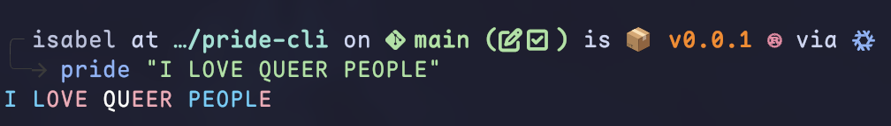

## Pride the cli

Generate yourself some nice pride flag styled strings



### Usage

We try to make this process as simple as possible, thats why all you need to do is supply the text! But if you want more indepth usages like changing the flag we have some examples below.

#### Examples


1) Print "Your text of choice" with a bisexual flag added to the background which groups the colors by 3 before changing to the next.

```sh
pride "Your text of choice" --flag bisexual --grouping 3 --style bg
```

2) Print "Mom, I like women" to with the recomended grouping, and styling the text

```sh
pride "Mom, I like women" --flag lesbian
```
